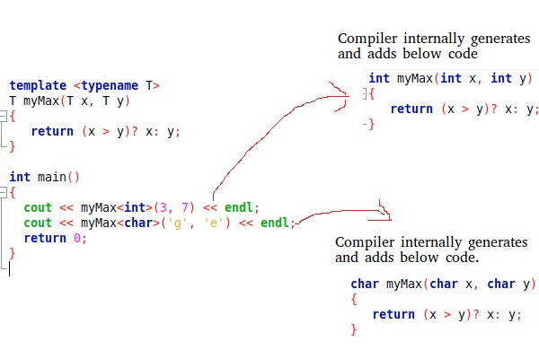

# The templates
## definition
* _The simple idea is to pass data type as a parameter so that we don’t need to write 
the same code for different data types._
* _Function overloading ("surcharge de fonction" in french) is used when multiple functions do quite similar 
(not identical) operations, templates are used when multiple functions do identical operations._
  * srcs: geeksforgeeks

  
## Default type
* Work the same as the template, but we instance the value of the template with a type. 
* When we call the template in the core of the main, if we put a type to the template, he took this type,
but if we put nothing the type will be the type we put to the template at the beginning of the program.
## Specialization
* 2 type of specialization partial or complete, class template.
* If a specialized version is present, compiler first checks with the specialized version and then the main template. 
Compiler first checks with the most specialized version by matching the passed parameter with the data type(s) 
specified in a specialized version.
## Reference

[Créez des templates](https://openclassrooms.com/fr/courses/7137751-programmez-en-oriente-objet-avec-c/7533236-creez-des-templates)

[Templates in C++ with Examples](https://www.geeksforgeeks.org/templates-cpp/)

[Template Specialization in C++](https://www.geeksforgeeks.org/template-specialization-c/)