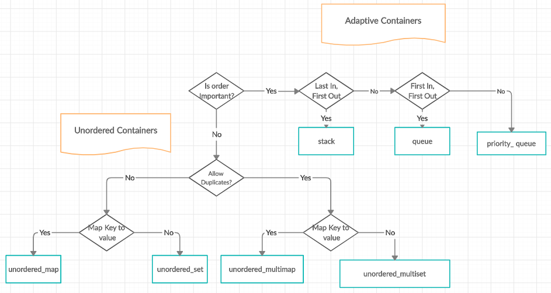
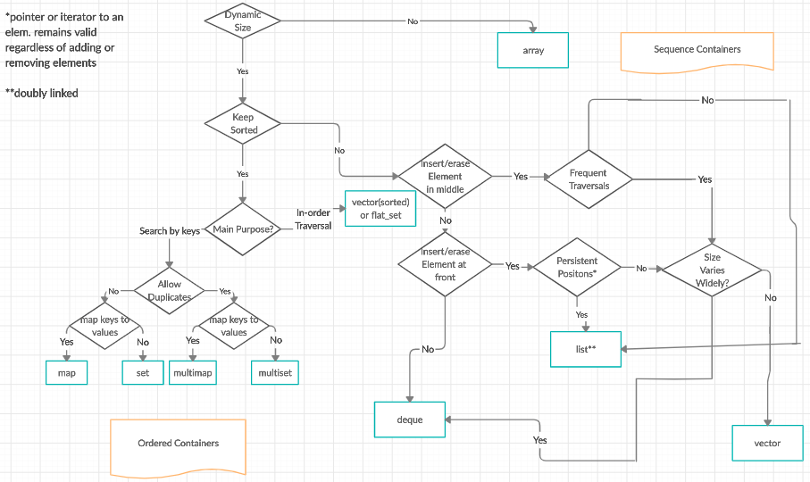

# The C++ Standard Template Library
## definition
* _**The standard Template library (STL)** is an ensemble of classe in C++, they provide programming data structures and functions
such as lists, stacks, arrays, etc... . it's a class of containers, algorithms and iterator. It's a generalized library and
it's components are parameterized._
* **Has 4 components**

## Algorithms
* The header Algorithm define a collection of functions, they are specifically used of a range of elements. They act of
containers.

* **Algorithm**

  * **Non mutating algorithms** → The algorithms that are known **to not modify** with any value of **a container object** and 
  they have nothing to do with the change in order of the elements in which they appear.
  These algorithms **are used for all the container objects and the real use of** the **forward iterators** is made by them only.
  * **Mutating algorithms** → The algorithms that **can be generally used to modify the value of a container** and have the
  **authority to change the order of the elements** in which they appear.
  * **Sorting algorithms** → The **modifying algorithms that are used to sort the elements in a container**.
  * **Set algorithms** → The algorithm that is generally **used to execute some functions on a container** that 
  results in improving the efficiency of a program. **Another name** by which this algorithm is known is **sorted range algorithm**.

* **Numeric Algorithm**
  * Relational algorithms : The algorithms that are generally **used to work on the numerical data**. These algorithms are 
  **designed mainly to execute the mathematical operations over all the elements that are present in a container**.

## Containers
Containers or container classes **store objects and data**. There are **seven standards “first-class”** container classes, 
**three container adaptor classes** and only **seven header files** that **provide access to these containers** or container adaptors.

 | container          | Description                                                                                                                                     | header file | iterator      |
|:-------------------|:------------------------------------------------------------------------------------------------------------------------------------------------|:------------|:--------------|
 | vector             | **Generally** a C++ classe, used to **create dynamics  array** that **allow** the **insertion** and **deletion** at the back.   | < vector >  | random access |
 | list               | Is the sequence containers that allow the insertion and deletion from anywhere.                                                         | < list >    | Bidirectional |
 | deque              | The double ended queue that allow the insertion and deletion from both ends.                                                            | < deque >   | Random access | 
 | set                | An associate container that  are used for storing unique sets.                                                                          | < set >     | Bidirectional |
 | multiset           | An associate container that  are used for storing non unique sets.                                                                      | < set >     | Bidirectional |
 | map                | An associate container that  are used for storing unique key value pair, and each key can be associated with only 1 value.      | < map >     | Bidirectional |
 | multimap           | An associate container that  are used for storing unique key value pair, and each key can be associated with more than 1 value. | < map >     | Bidirectional |
 | stack              | Stack generally follow the last in first out (LIFO).                                                                                        | < stack >   | No iterator   |
 | queue              | Queue follows first in first out (FIFO)                                                                                                     | < queue >   | No iterator   |
 | Priority queue | The first elements that is out is always of the highest priority level                                                                  | < queue >   | No iterator   |

## Reference

[Créez des templates](https://openclassrooms.com/fr/courses/7137751-programmez-en-oriente-objet-avec-c/7533236-creez-des-templates)

[Templates in C++ with Examples](https://www.geeksforgeeks.org/templates-cpp/)

[Template Specialization in C++](https://www.geeksforgeeks.org/template-specialization-c/)