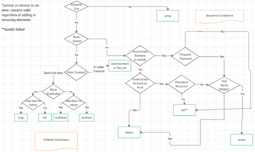

# The C++ Standard Template Library

## definition

> _**The standard Template library (STL)** is an ensemble of classe in C++, they provide programming data structures and functions
such as lists, stacks, arrays, etc... . it's a class of containers, algorithms and iterator. It's a generalized library and
it's components are parameterized._
* **Has 4 components**

## Algorithms

* The header Algorithm define a collection of functions, they are specifically used of a range of elements. They act of containers.

### Algorithm

* **Non mutating algorithms** → The algorithms that are known **to not modify** with any value of **a container object** and
  they have nothing to do with the change in order of the elements in which they appear.
  These algorithms **are used for all the container objects and the real use of** the **forward iterators** is made by them only.
* **Mutating algorithms** → The algorithms that **can be generally used to modify the value of a container** and have the
  **authority to change the order of the elements** in which they appear.
* **Sorting algorithms** → The **modifying algorithms that are used to sort the elements in a container**.
* **Set algorithms** → The algorithm that is generally **used to execute some functions on a container** that
  results in improving the efficiency of a program. **Another name** by which this algorithm is known is **sorted range algorithm**.

### Numeric Algorithm

* Relational algorithms : The algorithms that are generally **used to work on the numerical data**. These algorithms are
  **designed mainly to execute the mathematical operations over all the elements that are present in a container**.

## Containers

Containers or container classes **store objects and data**. There are **seven standards “first-class”** container classes,
**three container adaptor classes** and only **seven header files** that **provide access to these containers** or container adaptors.

| container          | Description                                                                                                                                     | header file   | iterator      |
|:-------------------|:------------------------------------------------------------------------------------------------------------------------------------------------|:--------------|:--------------|
| vector             | **Generally** a C++ classe, used to **create dynamics  array** that **allow** the **insertion** and **deletion** at the back.   | `<vector>`    | random access |
| list               | Is the sequence containers that allow the insertion and deletion from anywhere.                                                         | `<list>`      | Bidirectional |
| deque              | The double ended queue that allow the insertion and deletion from both ends.                                                            | `<deque>`     | Random access |
| set                | An associate container that  are used for storing unique sets.                                                                          | `<set>`       | Bidirectional |
| multiset           | An associate container that  are used for storing non unique sets.                                                                      | `<set>`       | Bidirectional |
| map                | An associate container that  are used for storing unique key value pair, and each key can be associated with only 1 value.      | `<map>`       | Bidirectional |
| multimap           | An associate container that  are used for storing unique key value pair, and each key can be associated with more than 1 value. | `<map>`       | Bidirectional |
| stack              | Stack generally follow the last in first out (LIFO).                                                                                        | `<stack>`     | No iterator   |
| queue              | Queue follows first in first out (FIFO)                                                                                                     | `<queue>`     | No iterator   |
| Priority queue | The first elements that is out is always of the highest priority level                                                                  | `<queue>`     | No iterator   |

## functions
* A function that is basically wrapped in a class in order to make it look like an object is known as the `Function object`.
* The function has the same functioning as functions pointers but better.
* A function is a class who overload the function call operator`(operator())`. The function has at less 3 advantages compare
  to the function pointer.
    1. performance: his function call operator can be inline.
    2. using : his members variables are more easily use.
    3. Can have a stats.

* Function object is also call `functor`, function in STL is called as the function object. It's basically means that if 
in case the programmer declare the object 'P' of a class int the operator() function in wiche it's defined and can be able
to use the object 'P' just like a regular function in STL.

  * **Let's consider that 'P' is an object of a class and then the operator () function in STL can be called as the method
that is depicted below:**
  *     P();

  * which is same as:

  *     P.operator() ( );

  * Here is an example of the function object that will help you understand the same in greater depth and will make you 
  understand the use of the function object in the STL:
  *     #include <iostream>
        using namespace std;
        
        class func_object
        {
        public:
            int operator()(int x, int y)
            {
                return x+y;
            }  
        };

        int main(void)  
        {  
            func_object fun;
            int res = fun(10,5);
            cout<<"Sum of x and y is : "<<res;
            return 0;
        }

  *     Output :Sum of x and y is : 15

## Iterator

* Iterator pointer-like entities (lol). They are used to point to the memory addresses of the containers STL. they are used
in numbers sequences, chars sequences, etc. They reduce the complexity and the time from program execution.

* the iterator a known to move sequentially from one element to another, this process is knows as iterating through a container
in C++.

### function in iterators

* Two function exist in iterators:
  * begin(): The first element of the vector are returned by the member function begin().
  * end(): The past-the-last element of the vector are returned by the member function end().

### Iterator categories

* five categories exist in which the iterators are divided:
  * Input iterator
  * Forward iterator
  * Bidirectional iterator
  * Random Access Iterator

## Reference

* [C++ Standard Template Library Tutorial(STL)](https://www.phptpoint.com/cpp-standard-template-library-tutorial/)
* [The C++ Standard Template Library (STL)](https://www.geeksforgeeks.org/the-c-standard-template-library-stl/)
* [Les algorithmes de la STL](https://r0d.developpez.com/articles/algos-stl-fr/)